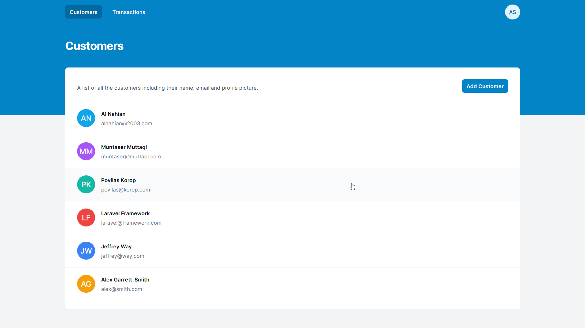
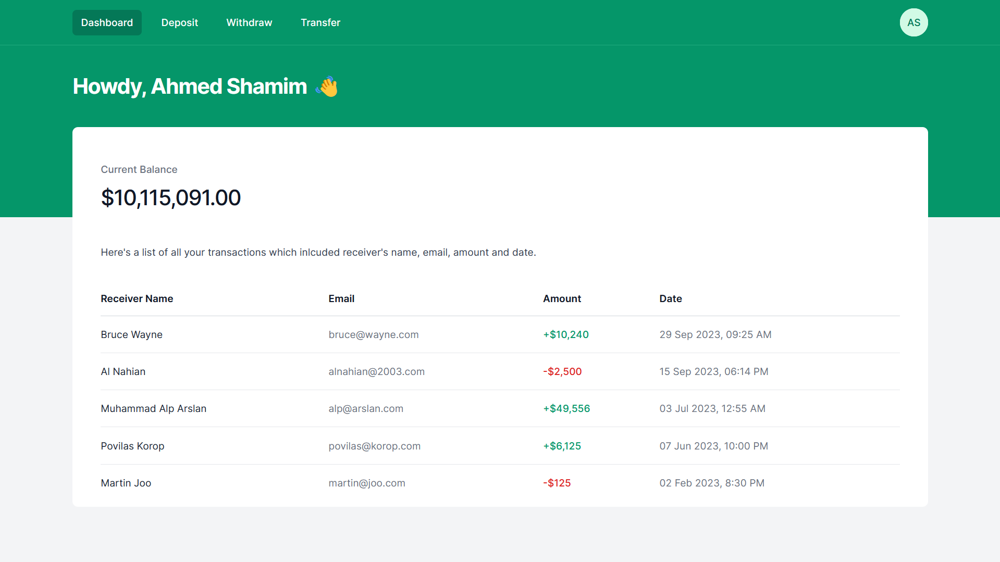

# BanguBank

BanguBank is a simple banking application with features for both 'Admin' and 'Customer' users. It's a HTML template starter pack for Laravel Career Path by Interactive Cares students.





### Admin Features

- See all transactions made by all users.
- Search and view transactions by a specific user using their email.
- View a list of all registered customers.

### Customer Features

- Customers can register using their `name`, `email`, and `password`.
- Customers can log in using their registered email and password.
- See a list of all their transactions.
- Deposit money to their account.
- Withdraw money from their account.
- Transfer money to another customer's account by specifying their email address.
- See the current balance of their account.

## Installation

Clone the repository to your local machine:

```bash
git clone https://github.com/alnahian2003/bangubank.git
```

```bash
cd bangubank
```

## Usage

1. Copy-paste the pages and directories in your own php project
2. No need to install tailwindcss and alpinejs, as the CDN is already included
3. seperate each files and components based on your own development technique
